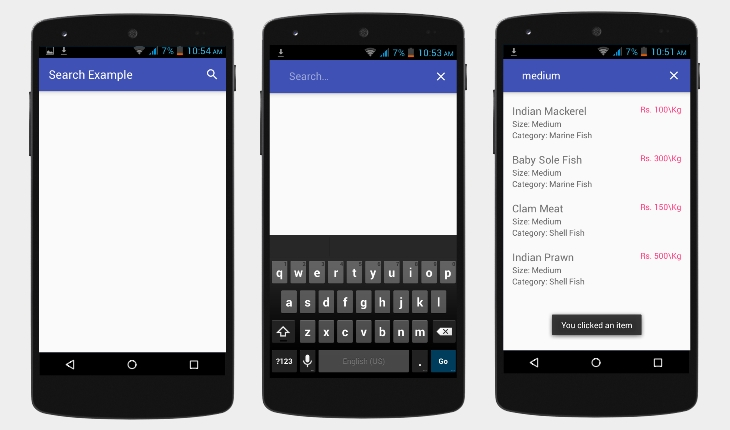

# Android Search View with PHP and MySQL

This tutorial demonstrates how to deal with search view in android using PHP as server side scripting language and MySQL as backend. For Tutorial  http://androidcss.com/android/android-search-view-php-mysql/
